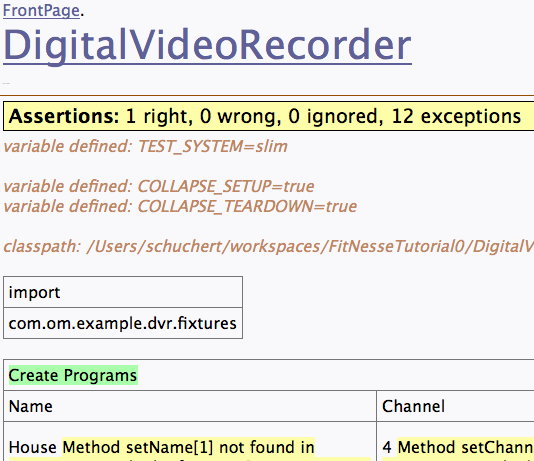
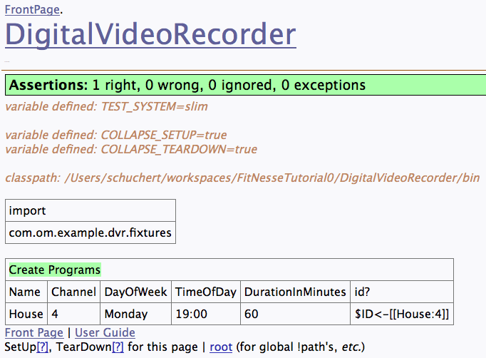

{:toc}
# Create Eclipse Project
In a nutshell, you are going to create a Java project, add some classes and then add the bin directory to the FitNesse path so that FitNesse can find and execute your Java Fixtures.

You can either [start with source from github](FitNesse.Tutorials.WorkingFromGitHub) and skip to the next section or:
* Start Eclipse
* Create a new Workspace (I used /Users/schuchert/src/fitnesse-tutorials/ as the directory)
* Create a Java Project (I used DVR)
* Set the JDK to 1.6: Eclipse Properties (Mac: command , | pc: File:properites):Java:Compiler:Compiler Compliance Level:1.6).

# Create Fixture for Test Table
* Add the package com.om.example.dvr.fixtures to your Java project
* Create a class called "CreatePrograms" to the com.om.example.dvr.fixtures package.

# Determine Where Eclipse Stores Your Class Files
Next, you'll need to know where Eclipse is placing your compiled Java classes.
* Hit ctrl-shift-r (apple: command-shift-r) to bring up the Open Resource dialog.
* Type in .classpath and press **Enter**
* Bring up the **Source** tab, and see if you have something similar to the following entires (the src output are the only ones that matter):


<?xml version="1.0" encoding="UTF-8"?>
<classpath>
	<classpathentry kind="src" path="src"/>
	<classpathentry kind="con" path="org.eclipse.jdt.launching.JRE_CONTAINER"/>
	<classpathentry kind="output" path="bin"/>
</classpath>


* If your .classpath has the same output directory, then Eclipse will be putting all of the Java .class files in the bin directory under the Project directory under the workspace directory (or the value of the path). In my case that equals: /Users/schuchert/src/fitnesse-tutorials/DVR/bin
* If your .classpath does not contain the kind="output", then chances are your class files are in the same directory as the source files. If so, you'd just use the same path but remove the bin directory(/Users/schuchert/workspaces/fitnesse-tutorials/DVR).
* If you are not sure, use a shell and find the root directory where your class files are stored. If you cannot, the next steps in FitNesse will not work.

# Add your code to Path
* Switch back to FitNesse, edit your page and add the following lines (above the table that is already there), making sure to adjust the value after !path as appropriate:


!path /Users/schuchert/src/fitnesse-tutorials/DVR/bin

|import|
|com.om.example.dvr.fixtures|


* Your page should now be (you might have an additional !path fitnesse.jar):


!define TEST_SYSTEM {slim}

!path /Users/schuchert/src/fitnesse-tutorials/DVR/bin

|import|
|com.om.example.dvr.fixtures|
 
!define COLLAPSE_SETUP {true}
!define COLLAPSE_TEARDOWN {true}
 
!|Create Programs                                        |
|Name |Channel|DayOfWeek|TimeOfDay|DurationInMinutes|id? |
|House|4      |Monday   |19:00    |60               |$ID=|


* Click on the **Test** button, you should see some green and yellow now:

You have two tables in your page. The first table is an import table, it tells FitNesse to import that package or namespace (e.g. if you're working with .Net). That is, when looking for fixture classes (classes that process tables), look in this package. If you want to import multiple packages or namespaces, use multiple rows (or duplicate the entire table).

The second table is a decision table. (Those familiar with Fit may recognize the similarity between Decision Tables and Column Fixtures.) The first row names a class, CreatePrograms in this case. You created this class above. The second row names the columns. Column headers that do not have a question mark in their name require a "set" method to back them. Column headers with a question mark require a method that returns a value. In our case we have 6 columns, so we need to add 6 methods, 5 setters and one method which returns a value. Here's the complete "stub" class to get this table fully passing:


package com.om.example.dvr.fixtures;

public class CreatePrograms {
    private String name;
    private int channel;

    public void setName(String name) {
        this.name = name;
    }

    public void setChannel(int channel) {
        this.channel = channel;
    }

    public void setDayOfWeek(String dayOfWeek) {
    }

    public void setTimeOfDay(String timeOfDay) {
    }

    public void setDurationInMinutes(int durationInMinutes) {
    }

    public String id() {
        return String.format("[%s:%d]", name, channel);
    }
}


* Edit your CreatePrograms class and add the missing methods.
* Notice that the implementation of id() returns a String with the name and channel. As you'll see, this value will show up later.

# Verify Your Tests Pass
* Go back to your browser and click the **Test** button. You should see the following:

# [Return and Complete Your Tutorial](FitNesse.Tutorials.0#Congratulations)
 
