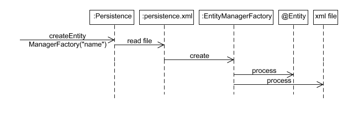
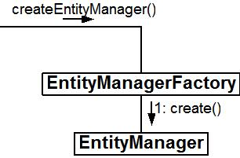

In this first tutorial we are going to perform some basic inserts, removes and queries against a database. 

JPA allows us to work with entity classes, which are denoted as such using the annotation @Entity or configured in an XML file (we'll call this **persistence meta information**). When we acquire the **Entity Manager Factory** using the **Persistence** class, the **Entity Manager Factory** finds and processes the **persistence meta information**.

To work with a database using JPA, we need an **Entity Manager**. Before we can do that, we need to create an **Entity Manager Factory.** 
> 
----
> 

To acquire an **Entity Manager Factory**, we use the class **javax.persistence.Persistence**. It reads a file called persistence.xml in the META-INF directory. It then creates the named **Entity Manager Factory**, which processes persistence meta information stored in XML files or annotations (we only use annotations).

Creating an **Entity Manager** once we have the **Entity Manager Factory** is simple:
> 

Once we have an **Entity Manager**, we can ask it to perform several operations such as persisting or removing an entity from the database or creating a query.

|~ Term|~ Description|
|javax.persistence.Persistence|This is a class used as an entry point for using JPA. The primary method you'll use on this class is createEntityManagerFactory("someName") to retrieve an entity manager factory with the name "someName". This class **//requires//** a file called **persistence.xml** to be in the class path under a directory called **META-INF**. |
| EntityManagerFactory | An instance of this class provides a way to create entity managers. Entity Managers are not multi-thread safe so we need a way to create one per thread. This class provides that functionality. The Entity Manager Factory is the in-memory representation of a Persistence Unit. |
| EntityManager | An Entity Manager is **the** interface in your underlying storage mechanism. It provides methods for persisting, merging, removing, retrieving and querying objects. It is **not** multi-thread safe so we need one per thread. The Entity Manager also serves as a first level cache. It maintains changes and then attempts to optimize changes to the database by batching them up when the transaction completes. |
| persistence.xml | A **required** file that describes one or more persistence units. When you use the javax.persistence.Persistence class to look up an named Entity Manager Factory, the Persistence class looks for this file under the META-INF directory. |
| Persistence Unit |A Persistence Unit has a name and it describes database connection information either directly (if working in a JSE environment) or indirectly by referencing a JNDI-defined data source (if working in a managed/JEE environment). A Persistence Unit can also specify the classes(entities) it should or should not manage .|
| Persistence Meta Information | Information describing the configuration of entities and the database and the association between entity classes and the persistence units to which they relate. This is either through annotations added to classes or though XML files. Note that XML files take precedence over annotations.|