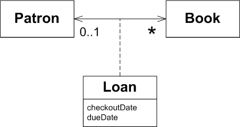

In the first version of our simple system, we had a 1 to many relationship from Patron to Book and a many to 1 relationship from Book to Patron. On a UML diagram, this looks like the following (only showing this one relationship):

In reality, this relationship might better be described as:

If you take the UML interpretation of this diagram, it says that when a Patron and Book come together, there are attributes associated withe the **relationship** between them.

We could simply put a few dates on the book, checkoutDate and dueDate. The problem is that when the book is checked out we have three non-null attributes: checkoutDate, dueDate, borrowedBy, and when the book is not checked out, those same three attributes are null. This seems a bit awkward.

So we are going to update our example to provide support for tracking the date a book was checked out and the date it is due. We will also calculate fines and move a bit closer to being able to fully support the use case to checkout books.
