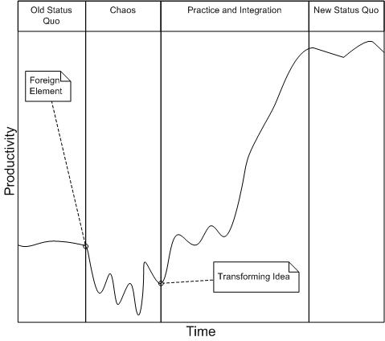

[<--Back](ExperientialLearningNotes)

## Satir Change Model

There are **4 stages** and 2 events in the Satir Change Model:
* **Old Status Quo**
* Foreign Element
* **Chaos**
* Transforming Idea
* **Practice and Integration**
* **New Status Quo**

### Old Status Quo
This is where we are right now.

#### Example
A company has an ailing software system that is deployed on old hardware. The cost of support for both the system and hardware has been rising recetnly due to age of the system and the dwindling number of people available to support either the software or the hardware.

### Foreign Element
This is some event or new information that simply cannot fit into how things are right now.

If we are able to integrate, ignore or handle the event, then we might just slip back into old status quo.

#### Example
The company with the ailing software system is told by the vendor of the aging hardware platform that the vendor will discontinue support in for that hardware platform in three years. The company can no longer justify the rising costs of supporting the ailing system since its hardware platform will no longer be supported.

### Chaos
This is what happens when a foreign element hits.

It is characterised by unpredictability.

#### Example
The company tries to convince the vendor to maintain support.
The company considers porting this old and fragile system to a new hardware platform.
The company considers rewriting from the ground up with all new employees.
The company considers rewriting from the ground up while retraining its work force in the new technology.
The company considers buying old machines so it can salvage parts to keep the hardware running itself.

### Transforming Idea
This is something that will allow us to move out of chaos.

#### Example
The company decides on a rewrite of the system using newer programming languages to address the difficulty of hiring people who know the old technology. They decide to use a consulting firm to assist in this transformation.

### Practice and Integration
Even though we are moving out of chaos, it still takes time to change our behavior.

#### Example
Starting with a small pilot project and a small team, the company builds one application on the new hardware with the new programming language. There are growing pains because the company needs to change how it develops applications. After a little success, it works on two more projects. One with the first team and one with a new team. Over time, the company learns how to develop applications using this new technology on a new hardware platform.

### New Status Quo
We are back to a comfortable working situation.

#### Example
The "new" way of doing this is now the status quo. The company has trained over 60 developers and has written millions of lines of code. With this success comes new problems. The company's pay scale is not competitive so they start losing some of their people. While they have learned to work in the small to medium, they still are having some pains working in the large, across division boundaries. Now that they've had some success, it is harder to schedule all the work that needs to be done since more work is being requested that in the past.

The company may not realize it but it is waiting for the next foreign element.

### How is this model useful?
At the beginning of a course or workshop, I might spend a few minutes first using the AlternatingHandGripExercise so people can get a quick kinesthetic experience that quickly takes them through the model.

I next explain the model and let them know that they will be going through this throughout the class.

I ask them during the AlternatingHandGripExercise to remember the feelings associated with the exercise. This is a way for the student to have a quick mind-body experience. Later, when they are in the midst of chaos, they might remember the exercise and realize they are in chaos. If so, then they are must better of than before they were aware of this model.

Sometimes I relate this model to [The Seven Stages of Expertise in Software Engineering](http://www.wayland-informatics.com/The%20Seven%20Stages%20of%20Expertise%20in%20Software.htm). When I do, I joke and say my goal is to get you to be less productive.

### Other Sources on the Satir Model
Now We're in Chaos: <http://www.chacocanyon.com/pointlookout/010919.shtml>

The Satir Change Model attempts to describe how change occurs for an individual. We can use it in our courses to give students an idea of what they are going to face when learning/experiencing new material.

The above link is written by Rick brenner: <http://www.chacocanyon.com/aboutrick.shtml>.

[<--Back](ExperientialLearningNotes)
