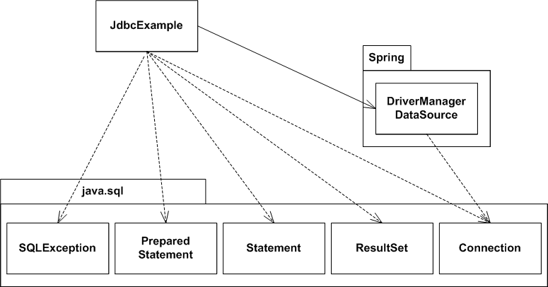

[<--Back](Designing_to_Spring_Templates)  [Next-->](Spring_Templates_JDBC_Using_Template_Method_Pattern)

## Using JDBC Directly
This is the base example. In it we:
* Set up the schema
* Insert several items into the database
* Query those items.

This is a recurring theme through all of the examples. The only real difference is how we design our code to hit JDBC.

Please see the notes on this example below the code.

### Class Relationships 

[[image:DesigningToSpringTemplates.v1.gif width="775"]]

### Important Note
All of these examples are configured to use [hsqldb](http://www.hsqldb.org/) which is a free database that supports both in-memory operation as well as using the disk (and other configurations). I've set it up to work strictly in memory. This means:
* Every time an application starts, we need to re-create the schema
* We lose all of the data at exit

Since this is NOT a JDBC example but rather I use JDBC as a vehicle to better understand the design behind the Spring templates, I figure this is a reasonable solution.

----

[#JdbcExample](#JdbcExample)
### JdbcExample.java

01: package aaa.valtech.jug.version1;
02: 
03: import java.sql.Connection;
04: import java.sql.PreparedStatement;
05: import java.sql.ResultSet;
06: import java.sql.SQLException;
07: import java.sql.Statement;
08: 
09: import loggingutil.ILogger;
10: import loggingutil.LoggingConfiguration;
11: 
12: import org.springframework.jdbc.datasource.DriverManagerDataSource;
13: 
14: import com.valtech.util.DatabaseUtil;
15: 
16: public class JdbcExample {
17:     private static final ILogger logger = LoggingConfiguration.getLoggerFor(JdbcExample.class);
18:     private final DriverManagerDataSource dataSource;
19: 
20:     public static final String CREATE_TABLE = "CREATE TABLE customer (First_Name char(50), Last_Name char(50))";
21: 
22:     public static final String INSERT = "INSERT INTO customer (First_Name, Last_Name) VALUES (?, ?)";
23: 
24:     public static final String SELECT_BY_FIRST = "SELECT First_Name, Last_Name from Customer where First_Name = ?";
25: 
26:     public JdbcExample() {
27:         dataSource = new DriverManagerDataSource();
28:         dataSource.setDriverClassName("org.hsqldb.jdbcDriver");
29:         dataSource.setUrl("jdbc:hsqldb:mem:mem:aname");
30:         dataSource.setUsername("sa");
31:         dataSource.setPassword("");
32:     }
33: 
34:     public void installSchema() throws SQLException {
35:         Connection c = null; // NOPMD by brett.schuchert on 7/11/06 11:09 PM
36:         Statement s = null; // NOPMD by brett.schuchert on 7/11/06 11:09 PM
37: 
38:         try {
39:             c = dataSource.getConnection();
40:             s = c.createStatement();
41:             s.executeUpdate(CREATE_TABLE);
42:         } finally {
43:             DatabaseUtil.close(s);
44:             DatabaseUtil.close(c);
45:         }
46:     }
47: 
48:     public void populateTables() throws SQLException {
49:         Connection c = null; // NOPMD by brett.schuchert on 7/11/06 11:09 PM
50:         PreparedStatement ps = null;
51: 
52:         try {
53:             c = dataSource.getConnection();
54:             ps = c.prepareStatement(INSERT);
55:             insertOneRecord(ps, "Brett", "Schuchert");
56:             insertOneRecord(ps, "Jeana", "Smith");
57:             insertOneRecord(ps, "Brett", "Anotherone");
58:         } finally {
59:             DatabaseUtil.close(ps);
60:             DatabaseUtil.close(c);
61:         }
62:     }
63: 
64:     private void insertOneRecord(final PreparedStatement ps, final String firstName,
65:             final String lastName) throws SQLException {
66:         ps.setString(1, firstName);
67:         ps.setString(2, lastName);
68:         ps.executeUpdate();
69:     }
70: 
71:     public void performSearch() throws SQLException {
72:         Connection c = null; // NOPMD by brett.schuchert on 7/11/06 11:09 PM
73:         PreparedStatement ps = null;
74:         ResultSet rs = null; // NOPMD by brett.schuchert on 7/11/06 11:09 PM
75: 
76:         try {
77:             c = dataSource.getConnection();
78:             ps = c.prepareStatement(SELECT_BY_FIRST);
79:             ps.setString(1, "Brett");
80:             rs = ps.executeQuery();
81:             logger.debug("Records found:");
82:             while (rs.next()) {
83:                 logger.debug("\n\t%s %s", rs.getString(1), rs.getString(2));
84:             }
85:         } finally {
86:             DatabaseUtil.close(rs);
87:             DatabaseUtil.close(ps);
88:             DatabaseUtil.close(c);
89:         }
90:     }
91: 
92:     public static void main(final String args[]) throws SQLException {
93:         logger.info("Version 1");
94: 
95:         final JdbcExample e = new JdbcExample();
96:         e.installSchema();
97:         e.populateTables();
98:         e.performSearch();
99:     }
100: }

### Interesting Lines
^
|Line|Description|

TBD

[<--Back](Designing_to_Spring_Templates)  [Next-->](Spring_Templates_JDBC_Using_Template_Method_Pattern)
