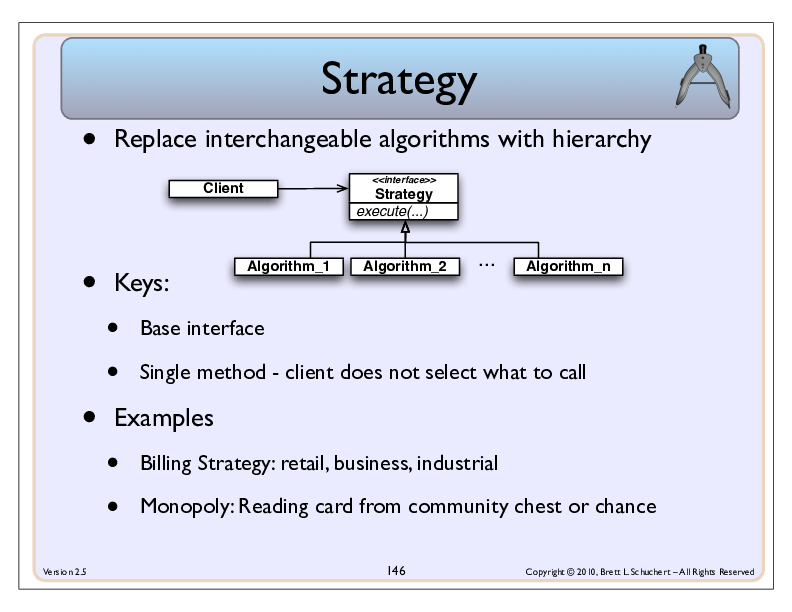
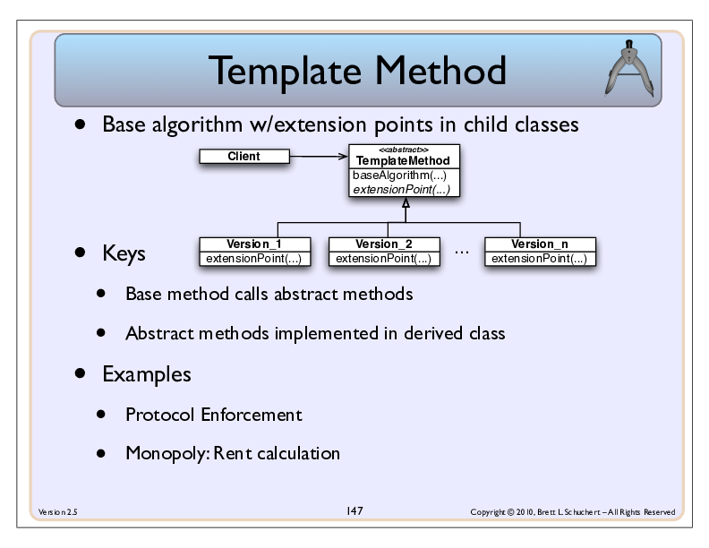



<section>
## Overview
These instructions give further details on a set of exercises in a [github repo](https://github.com/schuchert/rpn_exercises.git).

That repo is to practice different kinds of code refactorings. There are several exercises, each of which starts at a git tag in the repo.

The tags for this repo are:
1. 00-project-start
1. 01-wrap-collection-start
1. 01-wrap-collection-end
1. 02-open-closed-start
1. 02-open-closed-end
1. 03-strategy-pattern-start
1. 03-strategy-pattern-end
1. 04-factory-pattern-start
1. 04-factory-pattern-end
1. 05-template-method-start
1. 05-template-method-end
1. 06-composite-object-start
1. 06-composite-object-end

After cloaning, you can confirm this list by using git (not the order will be different from what is listed above):
```termial
git tag -l
```
</section>

<section>
## Working with the repo
You will need to install a few things for this to work. Have a look [here](https://schuchert.github.io/wikispaces/pages/java/project.from.scratch/using.gradle.html#prerequisites){:target="_blank"}.
Note, you will not need gradle installed as described [there](https://schuchert.github.io/wikispaces/pages/java/project.from.scratch/using.gradle.html#prerequisites){:target="_blank"}.

In addition, you probably want to install some IDE. Any of these will be fine:
* [Eclipse](https://www.eclipse.org/downloads/){:target="_blank"}
* [IntelliJ Comunity Edition](https://www.jetbrains.com/idea/download/){:target="_blank"}
* [NetBeans](https://netbeans.org/downloads/){:target="_blank"}

Once you have a command line, git, and an IDE, you are ready to:
* Clone the repo (do this once)
* Select an exercise and work on it
* Move to the next exercise to either review one possible solution or start another exercise

### Cloning Repo

Clone this project as usual and review the tags:
```terminal
git clone git@github.com:schuchert/rpn_exercise.git
cd rpn_exercises
git tag -l
```

### Select an exercise

In the repo directory, use git branch with a tag to create a branch based on one of the exercises, i.e.,
```terminal
git checkout -b <new_branch_name> <tag_name>
```

For example, to work on the (recommended) first exercise:
```termainl
git checkout -b wrap-collection-exercise 01-wrap-collection-start
```

You can now make commits to this branch as you normally would use git.

Once you are done, you can compare your results to master, which has one possible
solution to the problem presented in the exercise.

Before doing that, commit any changes you want to keep in the branch created for this exercise.

#### Currenntly Clean
Verify you are clean before comparing or switching to a different exercise.

```terminal
git status
On branch wrap-collections-exercise
nothing to commit, working tree clean
```

#### Compare to one possible solution
Assuming your changes are committed and you are in the branch you created to work on
the `01-wrap-collections-start` tag, you can compare your changes to master:

```terminal
git diff 01-wrap-collections-end
```

#### Switch to tag
When your repo is clean and you've reviewed your results against master,
you can start a new exercise by following the steps in
the [select an exercise above](#select-an-exercise) above.
</section>

<section>
## Wrap Collection
### Get Started
```terminal
git checkout -b wrap-collection-exercise 01-wrap-collection-start
```

### Background
An actual HP Rpn Calculator never runs out of values. If your regular Java stack runs
out of values, using `pop()` or `peak()` throws an exception. This makes the Java `Stack`
abstraction different from the needs of your domain. This makes using it directly
a possible (actual in this case) voilation of the
[Dependency Inversion Principle](https://en.wikipedia.org/wiki/Dependency_inversion_principle).

<aside>
In fact, most of the time, directly using any collection class violates the
[Dependency Inversion Principle](https://en.wikipedia.org/wiki/Dependency_inversion_principle).
This is why I recommend assuming you should wrap collections from the start and justify not
doing so, rather than introducing the abstraction later.
If you want to dig deper, have a look at [Dip in the Wild](https://martinfowler.com/articles/dipInTheWild.html).
</aside>

### Goal
We want to make our stack never empty. Technically the value returned should reflect the so-called
T register. We will simplify this and instead return 0 when all the user-entered values are gone.
(See [Rpn Description](https://schuchert.github.io/wikispaces/pages/Rpn_Calculator_High_Level_Description.html) for too much detail.)



### Check
When you've commited all your changes:
```termainl
git diff 01-wrap-collection-end
```

</section>

<section>
## Open Closed Principle
### Get Started
```terminal
git checkout -b open-closed-exercise 02-open-closed-start
```

### Background
The interface to the calculator changes every time you add a new operator.
This violates the [Open/Closed Principle](https://schuchert.github.io/wikispaces/pages/ruby/ruby.tutorials.bdd.UsingBddToDevelopAnRpnCalculator.html#openclosed)
Experiment with making a change to the API and get the code to pass.

### Goals
* Adding a new operator does not change the interface to the calculator
* All exisitng operators use the new approache
* The number of methods on the classs is significantly reduced
* Introduce some negative testing to make sure use of the new API produces "reasonable" errors



### Check
When you've commited all your changes:
```termainl
git diff 02-open-closed-end
```
</section>

<section>
    
## Strategy Pattern
### Get Started
```terminal
git checkout -b strategy-pattern-exercise 03-strategy-pattern-start
```

### Background
All of the operators look similar. Rather than writing each as its own function, we can
do the same thing as a class. Note: With Java 8 we could also use Lambdas, but for now
let's take more of a traditional approach to the Stragegy Pattern.


### Goals
We want to define an interface with a single method that will work all of the operators.
Review each of the operators, and determine what, if anything, is common across all
operators.

Once you've done that, create an appropraite interface, have each of the functions in
its own class, which implements that interface.

Update the solution from calling a bunch of functions to instead using instances of
the various subclasses of your new interface.



### Check
When you've commited all your changes:
```termainl
git diff 03-strategy-pattern-end
```

</section>

<section>
## Factory Pattern
### Get Started
```terminal
git checkout -b factory-pattern-exercise 04-factory-pattern-start
```

### Background


### Goals
There's an abundance of code in the `RpnCalculator` that can be put into its own class.
^



### Check
When you've commited all your changes:
```termainl
git diff 04-factory-pattern-end
```

</section>

<section>
## Template Method Pattern
### Get Started
```termainl
git checkout -b template-method-exercise 05-tempalte-method-start
```

### Backgound
There's quite a bit of duplication in all of the binary operators. Consider add versus subtract:
^
|add | subtract|
|`BigDecimal rhs = values.pop();` |`BigDecimal rhs = values.pop();` |
|`BigDecimal lhs = values.pop();` |`BigDecimal lhs = values.pop();` |
|`values.push(lhs.add(rhs));`     |`values.push(lhs.subtract(rhs));`|

In fact, the only difference is the calculation of the result. The "algorithm" then is:
1. Acquire operands (`lhs` and `rhs`)
1. Calculate the result (`add` or `subtract`)
1. Store the result (`push`)

The Template Method Pattern implements an algorithm in a (typically abstract)
base class and has one or more extension points (abstarct methods) for
derived classes to implement. Those derived classes fill in the details.



### Goals
* Remove the dupplication between the various binary operator classes.



### Check
```terminal
git diff 05-template-method-end
```

</section>

<section>
## Composit Object Pattern
### Get Started
```termainl
git checkout -b composite-object-exercise 06-composite-object-start
```

### Background
We want our calculator to be "programmable." By that, we can make our own combinariion
of existing operators. For example, [Pythagorean's theorem](https://en.wikipedia.org/wiki/Pythagorean_theorem):
^
$$
C^2 = A^2 + B^2
$$
^
$$
C = sqrt(A^2 + B^2)
$$

Given an a,b of (3, 4), we might do something like this with our calculator:
^
|---|--- | --- |
| Entry | Values on RpnStack | Who |
| 3| 3 | user |
| 2| 2, 3| user |
| pow | 9 | user |
|  4| 4, 9 | user |
|  2| 2, 4, 9| user |
|pow| 16, 9 | user |
| add| 25 | user |
|sqrt| 5 | user |

Imagine if we could turn that into a program named Pythagorean:
^
|---|---| --- |
|entry | Values on RpnStack | Who |
| 3 | 3 | User |
| 4 | 4, 3 | user |
| Pythagorean | 5 | user |

One way to write the program `Pythagorean` might be:
^
|---|---|---|
|entry | Values on RpnStack | Who |
| Pythagorean |4, 3| user |
| push2  | 2, 4, 3 | Pythagorean |
| pow | 16, 3 | Pythagorean |
| swap| 3, 16 | Pythagorean |
| push2  | 2, 3, 16 | Pythagorean |
| pow | 9, 16 | Pythagorean
| add | 25 | Pythagorean |
| sqrt| 5| Pythagorean |


### Goals



### Check
```terminal
git diff 06-composite-pattern-end
```
^

</section>
