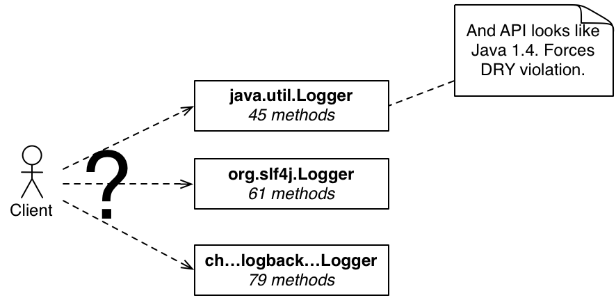

## Overview
You can safely skip to [the article](martin_fowler_blog_wip.DipInTheWild#article).

This is my WIP for an article for Martin Fowler's blog. The first cut is going to be a novelization of a talk I recently gave in Sweden. The materials for that (code and pdf of slides) are [on github](https://github.com/schuchert/spring_aop).

This is a first version I'll put together. Then, after I've reintroduced myself to Martin's development stack, I'll port, rewrite and edit in earnest. You can read into this that I'm going to take more time and care since it'll be on Martin's blog. In fact, this is approximately what I did with [my first article](http://martinfowler.com/articles/modernMockingTools.html).

I'm applying my extraversion to the creation of this work just because. Since a 50-minute talk and a blog are different media, I expect there'll be some differences. However, I could also offer the real scoop on the heavy use of SWAG + procstination that went into the original presentation for [SDC2013](http://www.scandevconf.se/).

{: #article}
# Dip in the Wild
My original introduction to the  [Dependency Inversion Principle](http://www.objectmentor.com/resources/articles/dip.pdf) came from Robert (Uncle Bob) Martin back in the last century, around 1994. It, along with most of the [SOLID](http://en.wikipedia.org/wiki/SOLID_(object-oriented_design)) principles, is simple to state but deep in its application. What follows are some recent applications I've used on real projects (everything I discuss is in production from June 2012 and as of 2013 is still in production, with one of these going back several more years).

Rather than define the dependency inversion principle, I'll first point to [wikipedia](http://c2.com/cgi/wiki?DependencyInversionPrinciple) and then a more in-depth coverage from [my original source](http://www.objectmentor.com/resources/articles/dip.pdf).

Where the description refers to abstractions, I've noticed many people confuse abstraction with:
* An interface
* An abstract base class.

In fact, the wikipedia article has a link to the idea, but a quick summary would include:
* An interface - if it exists at an appropriate level with sufficient lack of details
* An abstract base class - if it exists at an appropriate level with sufficient lack of details
* An idea
* The logical design level.

That is, as we will see, simply depending on an interface can (typically it seems to me) still violate the dependency inversion principle. Whether that is a bad thing or not, is a good follow-on discussion to have.

What follows are four examples of applying the dependency inversion principle in the "wild", or things I've done on projects, in the moment.
<aside>
### Pragmatics on Principles
Before going into examples, I want to give you my current (circa early 2013) perspective on design principles:
* I am not a personal fan of "best practices", but I do like good ideas for a given context.
* I think all design principles
** Should be "violated" sometimes
** Are often at odds with each other
** Often mix together for something even better than when used in isolation
* There are no free lunches, all abstractions have a cost

In fact, like the term "best practices" I wonder if "design principles" even makes sense as a moniker. In the case of the [SOLID](http://en.wikipedia.org/wiki/SOLID_(object-oriented_design)) principles, I think of them more as up front ideas that I often come back to due to familiarity.

In any case, an ability to make an informed decision to disregard a design principle, a so-called Journeyman according to [The Seven Stages of Expertise in Software](http://www.wayland-informatics.com/The%20Seven%20Stages%20of%20Expertise%20in%20Software.htm), is a good place to always be moving towards.
</aside>

## Logging

## Depending on Interfaces

## Message Oriented Middleware

## Assist in Multi-Thread Development (add this???)

## Metrics and a Feature Toggle

to be drawn, includes much code...

## Conclusion

Depending on an interface is not enough.

Enabling technology.
* separation of business from enabling tech
