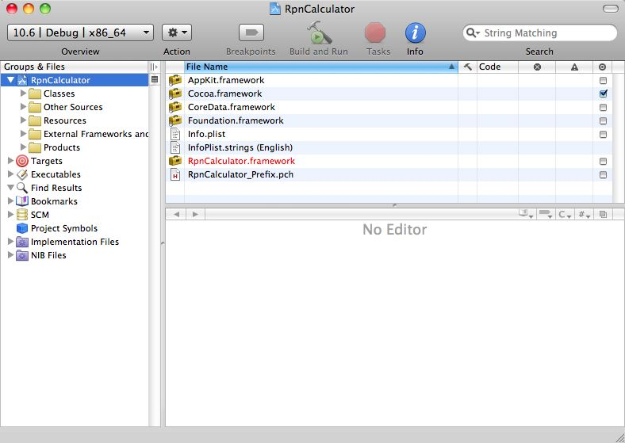
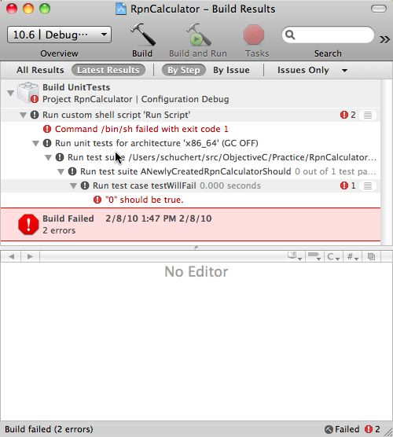
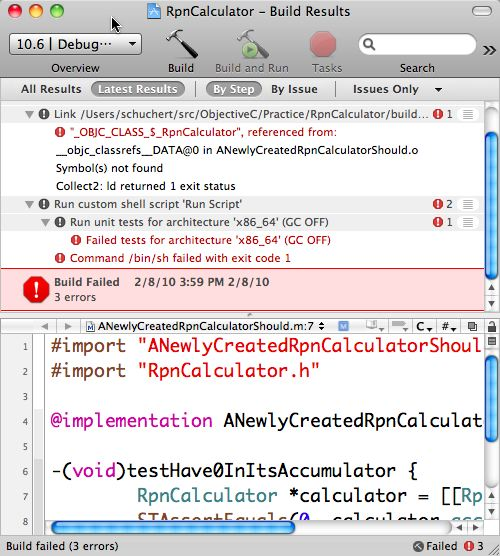

## Why?
It took a bit of digging to come up with the steps required to get basic unit testing working in XCode. These steps borrow heavily from the following sites (in no order, because I don't remember what all it took to get this working):
* <http://chanson.livejournal.com/182472.html>
* <http://developer.apple.com/tools/unittest.html>
* <http://www.devworld.apple.com/mac/library/documentation/DeveloperTools/Conceptual/UnitTesting/Xcode_Unit_Testing.pdf>

Much of my confusion comes from the difference between using "raw" Objective-C (relatively easy) versus XCode and all that implies. In any case, that's the environment I'll be using for courses, so that's what I need to be able to get working.

## What These Steps Describe
Technology:
* XCode 3.2.1
* The OCunit framework built-in to XCode 3.2.1
* Cocoa Framework
* Snow Leopard, though I suspect this will all work under any variant of 10.3 or later

These steps describe what you'll need to do to set up a framework, not an application. If you want to set up an application, review either of the bottom two links in the Why section.

## Video Version
[Tdd Objective C](https://vimeo.com/9394596);

## Setting up Project
* In XCode create a new project:**File:New Project** or**Command-Shift-N**
* Under the**Mac OS X Templates**, select**Framework & Library**
* Select**Cocoa Framework** on the right-side, top pane and either click**Choose** or double-click
* In the**Save As** box, enter a project name. I'll be using**RpnCalculator**
* Select the directory under which to create your project. I'll be using**/Users/schuchert/src/ObjectiveC/Practice**
* Click**Save**

At this point, you should have a window that resembles the following:

## Configuring for Unit Tests
* Under**Groups & Files**, select**RpnCalculator** and**right-click** (ctrl-click), select**Add:New Target**
* Under**Max OS X**, select**Cocoa**
* In the top-most right pane, select**Unit Test Bundle** and either**double-click** or click**next**
* Under**Target Name** enter some descriptive name. I'll use**UnitTests**.
* Click**Finish**
* This should bring up the info window on the target:

* Under the Direct Dependencies pane, click the**+** and add a dependency to**RpnCalculator** (double-click on**RpnCalculator**)
* Close the info window

## Adding a Test Fixture
Now you'll add a simple fixture with a failing test, then get the test to pass.

* Create a new File,**File::New** or**Command-N**
* Select**Cocoa class** under**Mac OS X**
* In the upper-most right pane, select**Objective-C test case class**
* Click**Next** (or double-click)
* Under the**File Name** enter some sensible test name (making sure to leave the ".m" at the end of the name alone). I'll be using**ANewlyCreatedRpnCalculatorShould**
* Under the**Targets** make sure to select**UnitTests** and to unselect**RpnCalculator**
* Click**Finish**

## Create a Failing Test
* Update ANewlyCreatedRpnCalculator.h to resemble:

#import <SenTestingKit/SenTestingKit.h>

@interface ANewlyCreatedRpnCalculatorShould : SenTestCase {
}

@end


* Update ANewlyCreatedRpnCalculator.m to resemble:

#import "ANewlyCreatedRpnCalculatorShould.h"

@implementation ANewlyCreatedRpnCalculatorShould

-(void)testWillFail {
	STAssertTrue(0, @"");
}

@end


## Build to run the test
Let's assume the for building you'll want to run the tests every time.
* Pull down the**Project** Menu, select**Set Active Target** and pick**UnitTests**
* Bring up the**Build** window:**command-shift-B** or**Build:Build Results**
* Click**Build**
* The test should fail:

## Get the test to pass
* Update the assertion line in ANewlyCreatedCalculatorShould from:

	STAssertTrue(0, @"");

To:

	STAssertTrue(1, @"");

* Save and re-build.
* All tests should be passing:

## Really Getting it all Tied Together
Now it's time to get the RpnCalculator framework linked into the test target. 
* Update the unit test (in ANewlyCreatedCalculatorShould.m):

#import "ANewlyCreatedRpnCalculatorShould.h"
#import "RpnCalculator.h"

@implementation ANewlyCreatedRpnCalculatorShould

-(void)testHave0InItsAccumulator {
	RpnCalculator *calculator = [[RpnCalculator alloc] init];
	STAssertEquals(0, calculator.accumulator, @"");
	[calculator release];
}

@end


This example imports a type that does not yet exist. So add it:
* Create a new file:**File:New** or**Command-N**
* Select**Cocoa Class:Objective-C class**
* Click**Next**
* Under**File Name:** enter:**RpnCalculator** making sure to leave the ".m" in place.
* Under the**Targets** section, select**RpnCalculator** and de-select**UnitTests**
* Click**Finish**
* Edit**RpnCalculator.h**:

#import <Cocoa/Cocoa.h>

@interface RpnCalculator : NSObject {
	int accumulator;
}

@property (readonly) int accumulator;

@end

* Edit**RpnCalculator.m**:

#import "RpnCalculator.h"

@implementation RpnCalculator

@synthesize accumulator;

@end


If you build now, you will get a linking error. Try it:

To Fix this:
* In the main window, under**Groups & Files**, select**RpnCalculator**
* In the top-most right pane, you'll see a list view; the first column has the name**File Name**.
* Scroll down until you see**RpnCalculator.framework**
* On the far-right side of that pane is a column with check boxes. Find the check box for the row containing**RpnCalculator.framework** and enable it:

* Build again (Command-Shift B, click the build button)
* You should have a successful build:

## Congratulations
You have a project configured to run unit tests when built.
* You can add "production" code to RpnCalculator and unit tests code to UnitTests.
* By default, a build will build the RpnCalculator framework, then UnitTests and then execute the unit tests.
At this point, you can continue practicing Test Driven Development.
